# emdr

Do It Yourself EMDR equipment (lightbar, buzzers and headphones). Firmware and controller app. 

## Hardware

Please watch this [video](https://youtu.be/0NRr-7e_mLk) about the project.

### Light bar

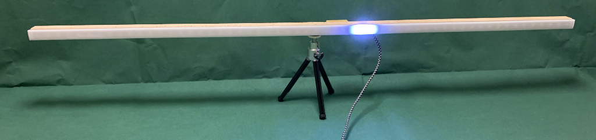

The invention of LED stripes with ready mounted LED pixels makes the DIY manufacturing of EMDR light bar a piece of cake. :-)

The only electrical component missing from these stripes is an USB connection. This is done by a Teensy microcontroller,
which implements a USB peripheral protocol on the one hand and the WS2812 serial bus on the other. The USB connection
also powers the microcontroller and the LEDs. Fortunately, an EMDR light bar never has more than one LED illuminated
at the same time, so USB current is sufficient.

Wiring is quite simple, since the Teensy LC already has a 5 V driver on board. 
Please refer to https://github.com/PaulStoffregen/WS2812Serial.

Teensy LC's 5V driver is hard wired to pin 17. Unfortunately, the WS2812Serial library does not support pin 17 as output.
But it supports pin 24. So connect pin 24 to pin 17 and thus to the input of the 5V driver.
Then connect the output of the driver, mostly named "17 at Vin voltage" (the pin between "3.3V" and "12"),
to DIn of the light strip.

You also have to connect 5V of the Teensy to 5V of the LED strip, same with GND. Since 5V and GND are looped through the
whole LED strip, it does not matter where to connect them. So you can use the solder pads that are closest to the Teensy.
However, that is different with the data line. You have to use the solder pin labelled "DI" or "DIn" at the end of the
LED strip.

#### Parts list

amount|article|example order link
---|----|----
1|WS2812 LED strip, 1m, 60 LEDs|https://www.amazon.de/gp/product/B01CDTED80
1|Teensy LC microcontroller|https://www.amazon.de/gp/product/B07CXMMP1T
1|aluminium profile for led strips|https://www.amazon.de/gp/product/B06XFT5X4T
2|end caps for led stip profile|https://www.amazon.de/gp/product/B06XGDJPG8
1|reduceer bushing 1/4" to 3/8"|https://www.amazon.de/gp/product/B01MT77RHN
1|mini tripod|https://www.amazon.de/gp/product/B001IXSIE8
950 mm|square wooden staff 19x19 mm|hardware store
1|Teensy case|[www.thingiverse.com/thing:2841269](https://www.thingiverse.com/thing:2841269)
6|countersunk screw 3.0x12 mm|hardware store
1|micro USB cable 1.8m|https://www.amazon.de/dp/B01GGKYE4U

#### Teensy LC replacement

When I came up with the original design in 2019, the Teensy LC microcontroller board was the best choice: cheap,
small, powerful, with USB and a 5V digital output port (driven by an onboard level shifter). Unfortunately, the Teensy LC
became poorly available and/or expensive over the years. If you have the chance to buy this board for less than 20€, then
it is still the first choice in my opinion.

It is not too easy to find a replacement with 5V output(s). There are some, but with other disadvantages. I wanted to provide
sustainable, cheap and easy solutions and went for the most common microcontroller boards (as of 2024). They all need
additional level shifters which are also cheap and available. Many other boards will work, but here are three alternatives,
all tested and supported by the recent software version:

_**D1 Mini**_

amount| article         |example order link
---|-----------------|----
1| D1 ESP8266 mini |https://www.amazon.de/gp/product/B0CB85Q78G
1| level shifter   |https://www.amazon.de/gp/product/B082F6BSB5

Wiring:

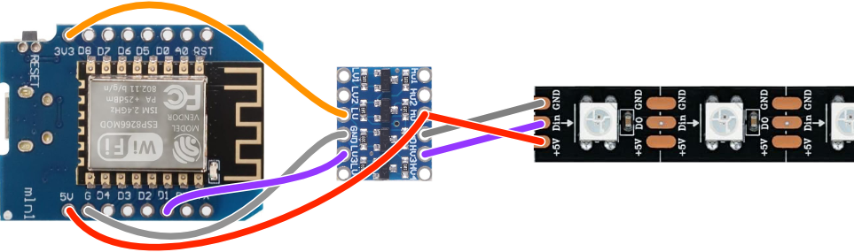

Please note that you can connect the 5V and ground cables to any corresponding position on the stripe, while the data
cable has to be connected to the leftmost "Din" pad.

For this microcontroller I provide Python code. For burning, I recommend [Thonny IDE](https://thonny.org/).
After connecting the board with your PC via an USB cable, you can follow these steps in Thonny:
- Open menu Run/Configure Interpreter...
- Choose "Micropython (ESP8266)" for interpreter and select the correct USB port
- Press "Install or update MicroPython (esptool)"
- Select "ESP8266" for MicroPython family, "Espressif - ESP82665" for variant and "1.22.1" for version
- You may have to click on the ☰-Button and select "Show install options"
- Select "dio" for Flash mode and "4MB" for Flash size, leave all other options at their default
- Press "Install" and wait until flashing is finished, then press "Close", then press "OK"
- On the left "Files" panel click on "This computer" and navigate to the [firmware/lightbar](firmware/lightbar)
  directory of this project.
- Now you should see "main.py" and "neopixel.py" in the "This computer" and "boot.py" in the "MicroPython device" 
  section of the file panel.
- Select "main.py" and "neopixel.py" (using the shift key), press right mouse button and select "Upload to /".
- After a short time you should see the files in the "MicroPython device" section, and you are done. Disconnect
  the board.

_**Raspberry Pi Pico**_

amount| article           |example order link
---|-------------------|----
1| Raspberry Pi Pico |https://www.amazon.de/gp/product/B09KVB8LVR
1| level shifter     |https://www.amazon.de/gp/product/B082F6BSB5

Wiring:

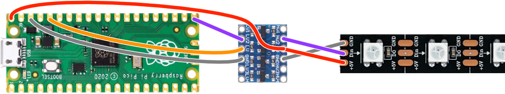

Please note that you can connect the 5V and ground cables to any corresponding position on the stripe, while the data
cable has to be connected to the leftmost "Din" pad.

For this microcontroller I provide Python code. For burning, I recommend [Thonny IDE](https://thonny.org/).
Please **hold down the "Bootsel" button** on the board while connecting it with your PC via an USB cable. 
Then you can follow these steps in Thonny:
- Open menu Run/Configure Interpreter...
- Choose "Micropython (RP2040)" for interpreter
- Press "Install or update MicroPython"
- Select the proper Targe volume, choose "RP2" for MicoPython family, "Raspberry Pi · Pico" for variant and
  "1.22.1" for version
- Press "Install" and wait until flashing is finished, then press "Close", then press "OK"
- On the left "Files" panel click on "This computer" and navigate to the [firmware/lightbar](firmware/lightbar)
  directory of this project.
- Now you should see "main.py" and "neopixel.py" in the "This computer" section and the "MicroPython device" section
  should be blank.
- Select "main.py" and "neopixel.py" (using the shift key), press right mouse button and select "Upload to /".
- After a short time you should see the files in the "MicroPython device" section, and you are done. Disconnect
  the board.

_**Teensy 4.0**_

This is a rather expensive board (around 30€) and the processor is quite oversized, so I would only recommend it
if you already have one.

amount| article       |example order link
---|---------------|----
1| Teensy 4.0    |https://www.amazon.de/gp/product/B07W5J3WNH
1| level shifter |https://www.amazon.de/gp/product/B082F6BSB5

Wiring:

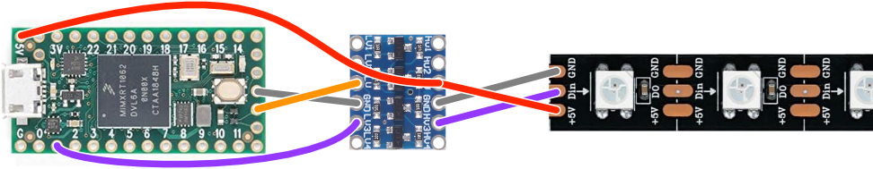

Please note that you can connect the 5V and ground cables to any corresponding position on the stripe, while the data
cable has to be connected to the leftmost "Din" pad.

The processor is powerful enough to run Micropython. Unfortunately I got regular glitches on the LED stripe using the 
Micropython code. I guess there are timing issues. So if you want to use the Teensy 4.0, please use the [C Code](firmware/lightbar/lightbar.ino)
and Teensyduino for flashing the firmware - just like with the Teensy LC. If you choose the right board in the IDE, the
code will adapt and use the correct port corresponding to the pin shown in the wiring diagram above.

_**Some notes:**_
- The controller software now supports any of the four recommended microcontrollers and detect them automatically
- If you want to use the buzzers, you also have to replace the microcontroller there. Please see below.

### Buzzers

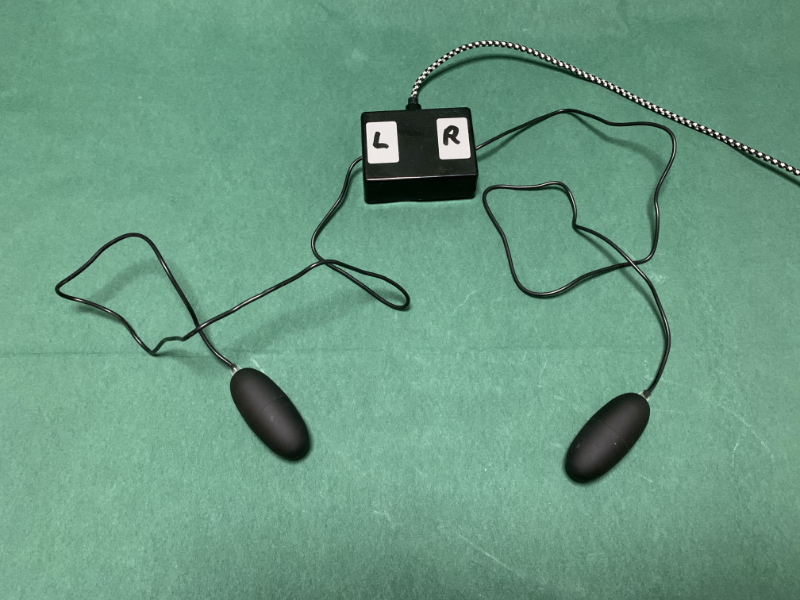

#### Parts list

It would be some act of handcraft to build your own buzzers. It is way easier to purchase some proper erotic device 
called "bullet vibrator" and disassemble the needed parts. 
You just should not tell your clients about the original purpose of these buzzers. ;-)

Again, to connect the buzzers to an USB bus, a Teensy microcontroller is used. Other than with the lightbar you need some
extra electronic components to drive the buzzer motors.

amount|article|example order link
---|----|----
2|bullet vibrator|https://www.amazon.de/gp/product/B000W735GC
1|Teensy LC microcontroller|https://www.amazon.de/gp/product/B07CXMMP1T
1|ULN2001A transistor array|[https://www.conrad.de/de/p/stmicroelectronics...](https://www.conrad.de/de/p/stmicroelectronics-transistor-bjt-arrays-uln2001a-dip-16-anzahl-kanaele-7-npn-darlington-177954.html)
1|resistor 10R, 1W|[https://www.conrad.de/de/p/weltron...](https://www.conrad.de/de/p/weltron-mfr1145-metallschicht-widerstand-10-axial-bedrahtet-0414-1-w-1-1-st-419320.html)
1|perfboard|[https://www.conrad.de/de/p/tru-components...](https://www.conrad.de/de/p/tru-components-su527769-europlatine-hartpapier-l-x-b-160-mm-x-100-mm-35-m-rastermass-2-54-mm-inhalt-1-st-1570681.html)
1|plasic case 75x25x56 mm|https://www.amazon.de/gp/product/B003WGT3N4
4|rubber base self-adhesive|[https://www.conrad.de/de/p/3m-sj-5302...](https://www.conrad.de/de/p/3m-sj-5302-mpcb-geraetefuss-selbstklebend-rund-transparent-x-h-7-9-mm-x-2-2-mm-80-st-527826.html)
1|micro USB cable 1.8m|https://www.amazon.de/dp/B01GGKYE4U
1|single row pin header (male & female)|https://www.amazon.de/dp/B016U9XYBG

#### Electronic schematic
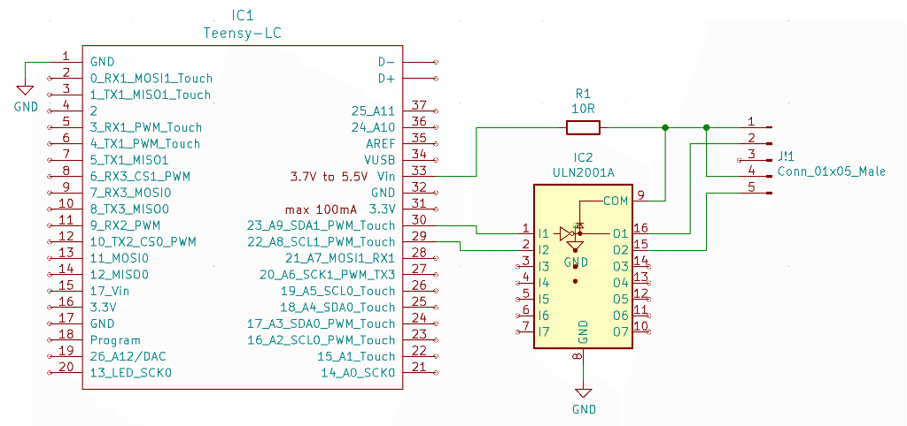

#### Electronic layout
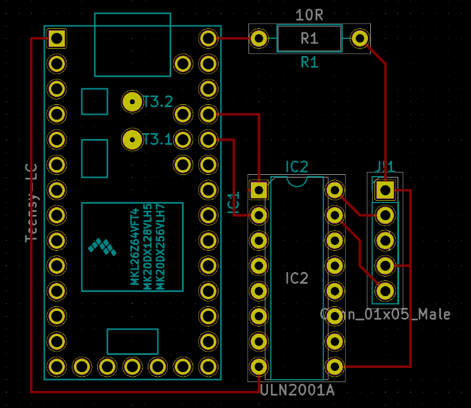

#### Teensy LC replacement

Though it is not a technical requirement, the software expects to find the same microcontroller type for the buzzer as
for the lightbar. Please use the corresponding replacement listed below. I also made wiring a bit easier by using a
new driver board.

_**D1 Mini**_

amount| article             |example order link
------|---------------------|------------------
1| D1 ESP8266 mini     |https://www.amazon.de/gp/product/B0CB85Q78G
1| UL2803 driver board |https://www.amazon.de/gp/product/B08CHC43YC

Wiring:

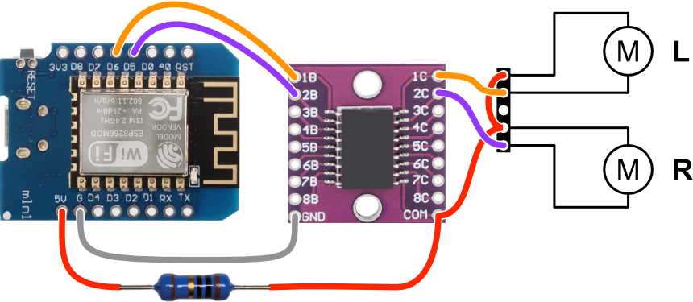

For this microcontroller I provide Python code. For burning, I recommend [Thonny IDE](https://thonny.org/).
After connecting the board with your PC via an USB cable, you can follow these steps in Thonny:
- Open menu Run/Configure Interpreter...
- Choose "Micropython (ESP8266)" for interpreter and select the correct USB port
- Press "Install or update MicroPython (esptool)"
- Select "ESP8266" for MicroPython family, "Espressif - ESP82665" for variant and "1.22.1" for version
- You may have to click on the ☰-Button and select "Show install options"
- Select "dio" for Flash mode and "4MB" for Flash size, leave all other options at their default
- Press "Install" and wait until flashing is finished, then press "Close", then press "OK"
- On the left "Files" panel click on "This computer" and navigate to the [firmware/buzzer](firmware/buzzer)
  directory of this project.
- Now you should see "main.py" in the "This computer" and "boot.py" in the "MicroPython device" 
  section of the file panel.
- Select "main.py", press right mouse button and select "Upload to /".
- After a short time you should see the files in the "MicroPython device" section, and you are done. Disconnect
  the board.

_**Raspberry Pi Pico**_

amount| article           |example order link
---|-------------------|----
1| Raspberry Pi Pico |https://www.amazon.de/gp/product/B09KVB8LVR
1| level shifter     |https://www.amazon.de/gp/product/B082F6BSB5

Wiring:

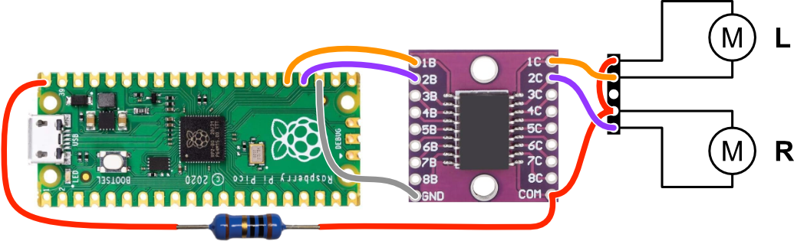

For this microcontroller I provide Python code. For burning, I recommend [Thonny IDE](https://thonny.org/).
Please **hold down the "Bootsel" button** on the board while connecting it with your PC via an USB cable. 
Then you can follow these steps in Thonny:
- Open menu Run/Configure Interpreter...
- Choose "Micropython (RP2040)" for interpreter
- Press "Install or update MicroPython"
- Select the proper Targe volume, choose "RP2" for MicoPython family, "Raspberry Pi · Pico" for variant and
  "1.22.1" for version
- Press "Install" and wait until flashing is finished, then press "Close", then press "OK"
- On the left "Files" panel click on "This computer" and navigate to the [firmware/buzzer](firmware/buzzer)
  directory of this project.
- Now you should see "main.py" in the "This computer" section and the "MicroPython device" section
  should be blank.
- Select "main.py", press right mouse button and select "Upload to /".
- After a short time you should see the files in the "MicroPython device" section, and you are done. Disconnect
  the board.

_**Teensy 4.0**_

This is a rather expensive board (around 30€) and the processor is quite oversized, so I would only recommend it
if you already have one.

amount| article       |example order link
---|---------------|----
1| Teensy 4.0    |https://www.amazon.de/gp/product/B07W5J3WNH
1| level shifter |https://www.amazon.de/gp/product/B082F6BSB5

Wiring:

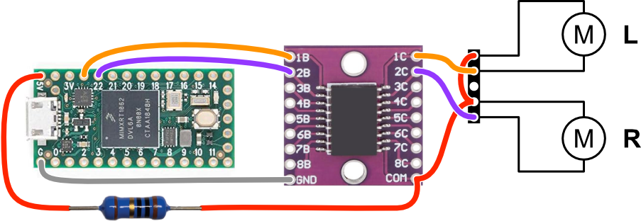

Actually, no change of the source code was necessary, because in this configuration the board in pin-compatible
to the TeensyLC. So if you want to use the Teensy 4.0, please use the [C Code](firmware/buzzer/buzzer.ino)
and Teensyduino for flashing the firmware - just like with the Teensy LC.

_**Some notes:**_
- The controller software now supports any of the four recommended microcontrollers and detect them automatically

### Controller

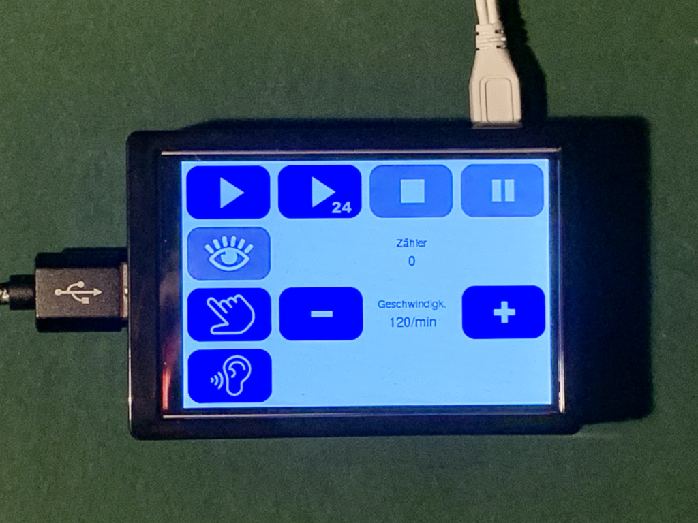

Controller is optional. You can also use a PC or Laptop with MacOS, Windows or Linux to run the controller software.

amount|article|example order link
---|----|----
1|Raspberry Pi model B+|https://www.amazon.de/gp/product/B07BDR5PDW
1|Micro SD-card 16 GB|https://www.amazon.de/gp/product/B008RDCCR6
1|3.5" touchscreen with case for raspberry pi|https://www.amazon.de/gp/product/B07S8CKW58
1|Pi 3 power adapter|https://www.amazon.de/dp/B01566WOAG

### Headphones

Sound stimulation is played by the integrated sound hardware, either of your PC or Raspberry Pi standalone controller.
Just attach an appropriate headphone to the sound jack.

## Software

### Lightbar and buzzers

Easiest way to program the Teensy microcontrollers is to use the [Arduino IDE](https://www.arduino.cc/en/Main/Software) with
[Teensyduino](https://www.pjrc.com/teensy/td_download.html) extension. You can run this on MacOS, Windows or Linux.
Just start the IDE, load the proper Arduino project file from my repository (subdirectory "firmware"), 
attach the teensy device, press the programming button on the device and the upload button in the IDE. Done.

You can test the device by using the Arduino serial monitor tool. Just send the letter "i". You should receive the
device identifier, either "EMDR Lightbar" or "EMDR Buzzer".

### Controller

#### On PC

Since the controller is a python script, you can run it on any platform supported by pyGame and pyUSB, e.g. Windows,
MacOS or Linux. You have to have Python 3.x installed.

Copy the files from my repository (subdirecotry "controller"), including the "imgs" directory.
Install necessary libraries with `pip install -r requirements.txt`or `pip3 install -r requirements.txt`.
In order to run the pyUSB library, you also need "libusb" to be installed. Please
see https://github.com/pyusb/pyusb for further instructions.

#### On Raspberry Pi

To set up a standalone controller on a Raspberry Pi, you would have to do some expert work, like installing a
Linux OS on a SD card, install and start the LCD driver for the touchscreen display, istall libusb,
change password, configure for graphical desktop with auto login, download and install the controller software
from my repository and set up the desktop to autostart the controller software after boot.

But fortunately, there is [PiBakery](https://www.pibakery.org/). You can use the "recipe"-File from my repository
(subdirectory "pi") and PiBakery to burn a ready-to-go SD-card. At the very first boot, the Raspberry Pi will download
and install all necessary software. For that, the Pi will have to have internet access. Just attach the Pi to your
local ethernet. After a while, the Pi reboots and shows the controller software. From now on, no network connection
is needed again. You can use the Pi as a simple controller panel for the EMDR equipment. 

